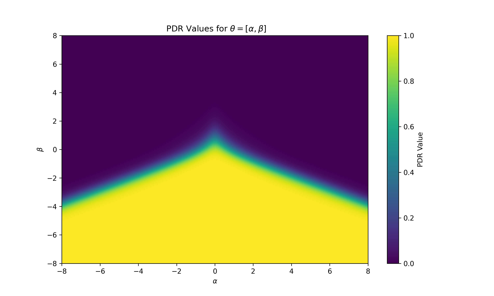
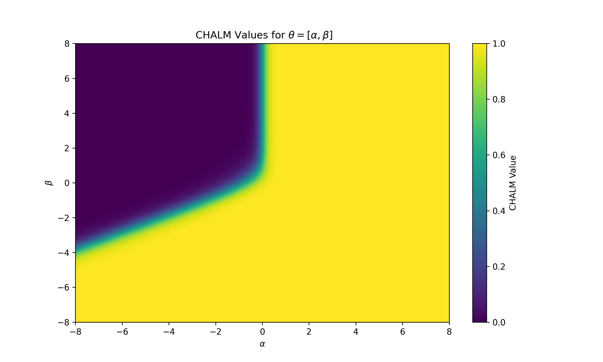
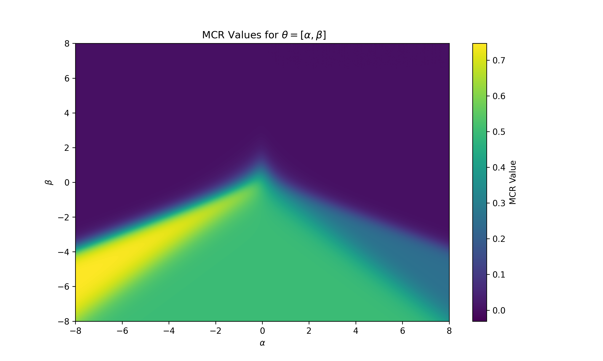
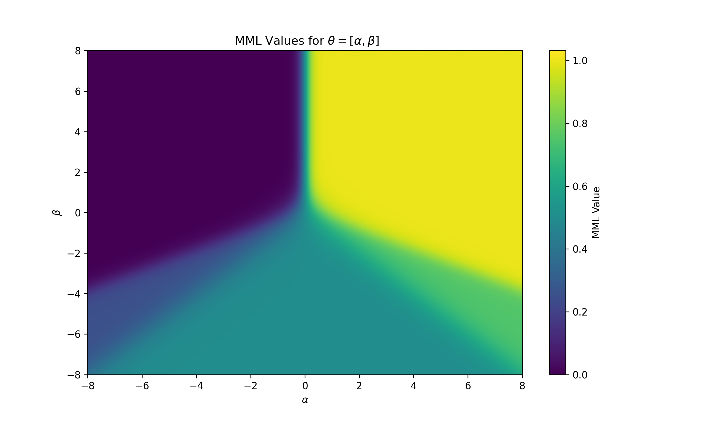
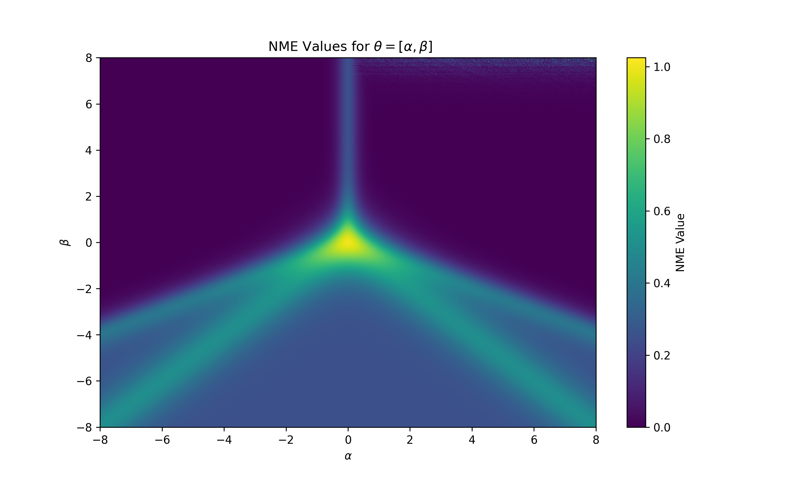

# CPELmHap: A Python Package for DNA Methylation Haplotypes Analysis via the CPEL Model

## Introduction
CPELmHap is a comprehensive Python toolkit designed for modeling DNA methylation haplotype data. This package builds upon the Julia package [CpelTdm.jl](https://github.com/jordiabante/CpelTdm.jl) and its underlying CPEL method [1].

Our objective goes beyond migrating the algorithm to Python. Based on the CPEL model, we have expanded the statistical metrics beyond the traditional Mean Methylation Level (MML) and Normalized Methylation Entropy (NME). In addition to performing differential analysis, this tool utilizes simulations to investigate the dynamic relationship between model parameters and these statistical metrics.

---

##  Requirements & Installation

* **Requirements:** Python 3.10+

Clone the repository and install the dependencies:

```bash
git clone [https://github.com/hhllee9/CPELmHap.git](https://github.com/hhllee9/CPELmHap.git)
cd CPELmHap

# Install dependencies
pip install numpy==1.23.4 pandas scipy pytabix statsmodels matplotlib
```
## Data Input
The core input file format is the mHap file, which can be generated using [mHapSuite](https://github.com/yoyoong/mHapSuite). Additionally, an annotation file containing CpG positions is required, which is also available via the [mHapSuite](https://github.com/yoyoong/mHapSuite) database.

|Data Type|Description|Format|Index|
| ------: | ---------: | :------------: | :------- | 
|Test File|Normal esophageal tissue (GSM4505856)|[SRX8208802.mhap.gz](http://bioinformatics.sibcb.ac.cn/dataupload/DataSets/ESCC/mHap/SRX8208802.mhap.gz) | [SRX8208802.mhap.gz.tbi](http://bioinformatics.sibcb.ac.cn/dataupload/DataSets/ESCC/mHap/SRX8208802.mhap.gz.tbi) |
|Annotation File|Whole genome hg19|[hg19_CpG.gz](http://bioinformatics.sibcb.ac.cn/dataupload/iGenome/CpGs/hg19/hg19_CpG.gz) | [hg19_CpG.gz.tbi](http://bioinformatics.sibcb.ac.cn/dataupload/iGenome/CpGs/hg19/hg19_CpG.gz.tbi) | 

## Parameter Estimation
You can use the test data to infer the parameters of the CPEL model. Based on the specified chromosomal region and a fixed sliding window size (default step=500), you can estimate the core CPEL model parameters ($\alpha$, $\beta$) for the CpG sites within that region.

```Python
import pandas as pd
import random
import numpy as np
import functions as F
# 1. Configure file paths
cpg_sites_file = "hg19_CpG.gz"
data = pd.read_csv('SRX8208802.mhap.gz',sep='\t',header=None,dtype={3:'str'},low_memory=False) 

# 2. Define parameters and genomic region 
chr='chr1'
start=10469
end = 11468
random.seed(42)
np.random.seed(42)

# 3. Run parameter estimation
n_list, theta, _ = F._cal_cpel(cpg_sites_file, data, chr=chrom, start=start, end=end, step=250, compress=False, vis=False)
print((n_list, theta))

```
Output Result:
|  Sub-region | $R_1$ | $R_2$ | $R_3$ | $R_4$ |
| :--- | :---: | :---: | :---: | :---: |
| **No. of CpG sites** | 38 | 46 | 29 | 10 |
| **$\alpha$** | `0.58661831` | `0.29509442` | `-4.99925082` | `-2.01572819` |
| **$\beta$** | `0.28081937` *(Global)* | | | |

## Simulations
We provide a standalone module to run Monte Carlo simulations to validate the performance and statistical power of the newly introduced metrics in differential analysis.

```
Bash
# Usage: python Simulations.py <test_type: unmat/mat> <m_samples> <n_cpgs> <theta1> <theta2>
# Example: Unpaired test, 5 samples per group, 4 CpGs, comparing theta1=[0.5,0.5] and theta2=[0.5,0.5]

python Simulations.py unmat 5 4 0.5,0.5 0.5,0.5

```
The resulting empirical cumulative distributions for different statistics are visualized below:

## Relationship Between Statistics and Model Parameters
In this module, we generate heatmaps to visually demonstrate the relationship between the underlying CPEL model parameters ($\alpha$, $\beta$) and the various methylation statistics.
## Relationship Between Statistics and Model Parameters

<p align="center">
  
  
  
</p>
<p align="center">
  
  
</p>

## References
[1]  Abante, J. and J. Goutsias, CpelTdm.jl: a Julia package for targeted differential DNA methylation analysis. bioRxiv, 2020: p. 2020.10.17.343020.
[2]	Hong, Y., et al., mHapBrowser: a comprehensive database for visualization and analysis of DNA methylation haplotypes, in Nucleic Acids Res. 2024: England. p. D929–D937.
